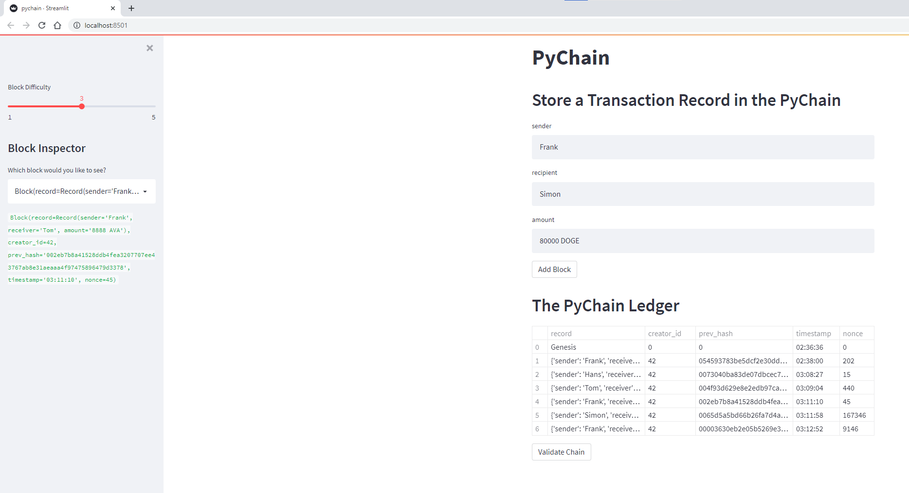
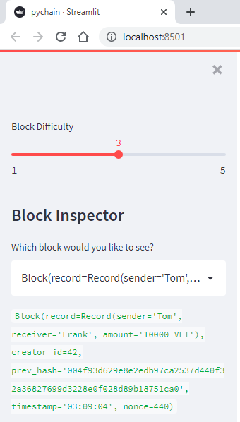
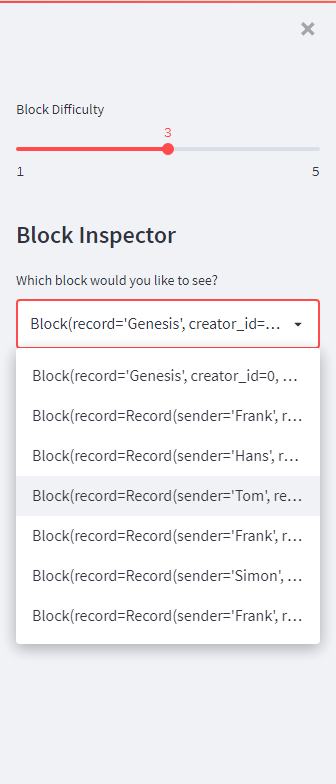
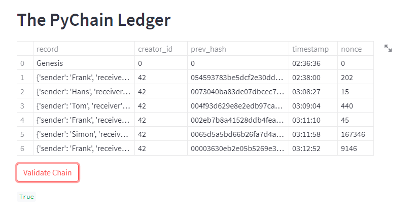

# PyChain Ledger

In this project I created a simple Blockchain ledger structure using python and the streamlit web application.

## Streamlit Web Application

## Sample Block Information

## Dropdown Menu which shows all Block Contents

## Validating the Chain
Pressing the "Validate" button on the streamlit web application will return the green word "true" if the chain is operating correctly.

